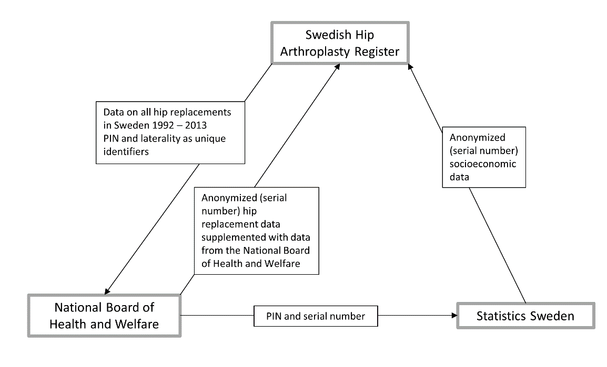

--- 
title: Some Statistical Background and Epidemiological Methods for a Shared Decision Making Tool for Total Hip Arthroplasty 
author: "Erik Bülow" 
date: "`r format(Sys.time(), '%Y-%m-%d')`" 
output: 
  pdf_document: 
    fig_caption: yes 
    number_sections: yes 
    toc: yes 
documentclass: report 
classoption: a4paper 
geometry: top=1in, bottom=1.25in, left=1.25in, right=1.25in 
---


```{r setup, include = FALSE} 
knitr::opts_chunk$set(echo = TRUE, fig.align = "center") 
```


# Research plan

*This chapter constitute an individual study plan for PhD studies performed by
Erik Bülow at the Department of orthopedics, Institute of clinical sciences,
Sahlgrenska Academy, University of Gothenburg, and by the Swedish Hip
Arthroplasty Register.*


## Background

### Total hip arthrolpasty

Total hip arthroplasty (THA), also known as ''total hip replacement'' (THR), is a
common and well established surgical procedure to increase quality of life for
patients with:

\begin{description}

\item[Hip osteoarthritis (80 \%): ]{THA is an elective treatment for these
patients and is therefore offered mainly to relatively healthy individuals.}

\item[Hip fracture of the femoral neck (10 \%): ]{This mainly affects old and
fragile patients (more common among women) or young and very physically active
individuals (such as professional athletes).}


\item[Other causes (10 \%): ]{Mostly inflammation, malignancy or causes related
to child diseases. These patients are not further considered within this
project.}

\end{description}


The incidence of hip arthroplasty is approximately 16,000 annual cases in Sweden
and the need is increasing due to longer life spans and therefore an increasing 
elderly population.


## A shared decision making tool

It is known that the patients’ preoperative health characteristics have an 
important impact on their health status after hip arthroplasty. Sharing this 
information with the patients in form of a shared decision-making tool (SDM) 
have been long advocated. It presumes that preoperative medical information and 
patient-reported outcome measures can aid the medical profession to make 
adequate predictions of patient outcomes (such as ''quality of life'').

One of the main challenges in constructing such a shared decision making tool is
to gather sufficient and relevant data. Such data often needs to be collected
from different sources and come in different shapes and formats. The limiting
factor is not the scale but the heterogeneity of the data. In order to succeed
with SDM tools, fine-grained data are required to build models actionable at
individual level.


### Linkage studies

Sweden facilitates high quality linkage-studies by the adoption of the 10-digit
personal identity number (PIN) maintained by the Swedish tax agency. This
10-digit PIN allows a near-by 100 per cent coverage of the Swedish healthcare
system and it is instrumental for linkage between population and health data
registers.

Beside the top-down initiated governmental agencies, so called ''quality 
registers'' have been initiated and managed by the medical profession during the 
last couple of decades. These provide data centered around diagnoses, implants 
or medical procedures. In addition to facilitating national, regional and local 
quality improvement programs, they also provide research data of high quality.

In this research project, we will use data from The Swedish Hip Arthroplasty
Register (SHAR); one of the first quality registers in Sweden, founded in 1979.


## Overall research aim and central research questions

A current research aim for SHAR is to develop a shared decision making tool for 
patients with total hip arthroplasty. It is the goal of this project to
contribute with evaluation of some statistical and epidemiological methods of
value for this decision tool. It is here not only of value to develop new
methods, but also to question sometimes unjustified methods previously
recommended.

We will put special attention on the following research questions:

1. Is the current practice to predict mortality by co-morbidity really of value 
for otherwise healthy patients with elective total hip arthroplasty? 
2. Does
this aspect differ considering the smaller and quite different patient group
with hip arthroplasty after acute femoral neck fracture? 
3. Can we improve the
current practice of handling missing co-morbidity data for prediction of
mortality? 
4. Can we also put all this into practice by contributing with
software tools to facilitate patient classification of co-morbidity and other
relevant data? 
5. How do we best describe and model patients with bilateral hip
arthroplasty?

The project is thus a mix between epidemiology, statistics, medicine and 
computer science, a mix sometimes refereed to as ''data science''.


## Data




Data have already been acquired from three main sources (figure 1).

1. The starting point was SHAR from where we identified all first time (primary)
hip arthroplasty surgeries in Sweden from 1992 to 2013. Cases are here
identified by personal identification number (PIN) and laterality (left or right
hip). 
2. The SHAR data was then submitted to the National Board of Health and
Welfare (Socialstyrelsen) who supplied us with co-morbidity data from the
national patient register (NPR). They removed the PIN and replaced it with a
serial number in order to anonymize the data. 
3. Next, the National Board of
Health and Welfare forwarded the list of PIN's and serial numbers to Statistics 
Sweden (SCB) to obtain requested socioeconomic variables. 
4. Finally, Statistics
Sweden returned a data set to SHAR with the serial number and laterality as the 
only unique identifiers.


Then, the data set contains:

\begin{description} 

\item[Patient characteristics: ]{age, sex, location of
residence, sociodemographics, dates of surgery, possible co-morbidities and date
of death} 

\item[Prosthesis data: ]{surgical techniques and components used} 

\item[Hospital data: ]{hospitals and surgeons responsible for treatment et
cetera} 

\item[PROM: ]{patient reported outcomes reported 1, 5 and 10 years after
surgery, and preoperatively for elective THA} 

\end{description}


## Ethics

This project does not involve any patients directly, nor any regular medical 
journals or biological samples. We do on the other hand use extensive data of 
sensitive nature. It is therefore important to secure the integrity of all 
patients indirectly involved.

This type of study does not require informed consent from registered patients. 
Neither has it been mandatory to inform the patients about the registration in 
SHAR, during most of the period when our data was collected. It is however 
mandatory today and it is also possible (although uncommon) for patients to now 
withdraw their previous implicit consent.

Data in a quality register is owned by the organisations treating the patients 
and it should be primarily used for quality assurance and development of medical
procedures within each clique or hospital. The distinguish between this and 
research is not clear-cut but an ethical approval for the research was retrieved
from the Regional Ethical Review Board in Gothenburg (reference number 271-14).

During the whole process we will make sure that no patients will be identified 
on an individual level. The key for linking the serial numbers to the PIN is 
saved at the National Board of Health and Welfare and researchers will under no 
circumstances be granted access to this key.

We will also ensure that patients and other interested parties are kept informed
about the research performed. This is done through a project data base on SHAR's
web site.


## Theory of science

The very goal of the project is to use the deductive principles of mathematics, 
through the applied and best available methods of statistics to ensure that the 
empirical observations from patient data will result in reliable and sound 
conclusions based on induction and deduction combined.

It is the belief of this project that scientific principles are not always 
falsified even when they could be, and that research methods are sometimes 
proposed for one area but then adopted to others, where the same circumstances 
or assumptions do no longer apply. It is our aim to uncover some black boxes and
to re-evaluate if some common practices are really of value for a shared 
decision making tool for patients with possible need of total hip arthroplasty.


## Individual studies

We aim at five individual studies to complete the PhD thesis.


### Mortality predicted by comorbidity after elective THA


#### Background

It is often suggested that studies on mortality should adjust for possible 
co-morbidities as con-founders. The International Classification of Diseases, 
10th Revision (ICD-10)-based co-morbidity indices, such as the Elixhauser or the 
Charlson, have been developed for this purpose and many researches have 
investigated their reliability. The practice has also proved useful for patients
with life threatening diseases such as cancer, for whom death is a possible 
outcome.


#### Aim

We intend to investigate the long-term predicative power of the Elixhauser and 
Charlson co-morbidity indices for patients with total hip arthroplasty. Elective 
hip arthroplasty is offered to otherwise healthy individuals. It is therefore 
unlikely that this cohort suffer from diseases causing death in a nearby time 
frame. It might therefore not be relevant to predict their mortality by 
co-morbidities present already before the surgery. To avoid that burden would be 
preferable to a DSM since this practice requires massive external data from 
outside the SHAR register.

Also, when short-term survival predictions are undertaken, statistical methods 
more suited for a binary outcome (such as death within a specified time frame) 
are often used. It is therefore our intention to apply a statistical method 
specially developed for survival data and to carefully investigate all relevant 
assumptions for such a method to hold.


### Mortality predicted by comorbidity after acute THA


#### Background

Every tenth prosthesis in Sweden is the result of an acute femoral neck
fracture. This affects mostly old and fragile patients for whom co-morbidity
might be a relevant predictor of mortality.


#### Aim

We aim to investigate similar aspects as for the previous study but for patients
with THA after an acute femur neck fracture.


### Methods for missing comorbidity data

#### Background

If co-morbidity would be a relevant predictor of mortality, it would also be 
necessary to investigate how current methods and co-morbidity data could be used.
Data on co-morbidity is not easily gathered, not even in Sweden that is otherwise
world leading regarding register studies based on publicly availability and well
organized data centered around the PIN.

It is common practice to use data from the national patient register but this
source does not cover primary health care and its quality and reliability differ
between public and private health care providers and between somatic and 
psychiatric health care.


#### Aim

It is our intention to compare data from the national patient register to data 
from the medical prescription register. We will also evaluate if the common 
practice to combine patients without registered co-morbidities, with patients 
completely missing from the data source at hand, is actually relevant due to 
survival and self-reported quality of life, or if these two patient groups 
should be differentiated.

This is a methodological question not only relevant for the Swedish hip 
arthroplasty register. We therefore intend to collaborate with the national 
diabetes register and to also compare the result with a sample from the general 
Swedish population.


### Software development to facilitate fast deterministic (patient)
classification

#### Background

To investigate co-morbidity on a large scale, such as now intended, it is useful 
to have a supporting computer infra structure. The open-source and freely 
available R software is the preferred choice for many statisticians, and we want
to work with co-morbidity classification within this framework.

A first naive implementation took around 18 hours to run on a standard computer.
The best available R-package found on-line reduced the time to around half an
hour but this is still quite slow for the modern computer era.


#### Aim

We decided to develop an R-package of our own with the goal to reach computation
time close to half a minute. This is done by a change of the underlying data 
structure, both regarding data sets and code identification schemes. Most of the
work concerns the software package itself but we also intend to describe the 
implementation in an article for a software oriented journal.

The implementation will be based on abstract principles and might therefore be
of interest also to other classification problems, such as for adverse events
(as identified by similar methodology as co-morbidities, but after, and not
before, the time of surgery).


### Modelling strategies for bilateral THA

#### Background

Most patients with THA have only one hip replaced (unilateral cases). It does
however become more and more common to have the same procedure performed also
for the second hip (bilateral cases). This introduce problems when analyzing and
modelling THA data, since two hips from the same patient can not be assumed
independent (which is assumed by most standard statistical methods to work
properly).

It is now common to simply ignore the last operated hip for patients with 
bilateral cases. Statistically more advanced methods have been proposed in the
literature but have so far not been evaluated for these patients in practice.


#### Aim

It is our intention to first characterize possible differences between the first
and secondly operated hip, and between patients with one and two hips operated. 
We will thereafter also investigate, and finally suggest possible statistical 
methods to use for future analyses containing bilateral cases.


## Supervising

This project requires cross-disciplinary supervising. Professor Göran Garellick 
and orthopedic surgeon Ola Rolfson will provide expertise in orthopedics related
questions. Statistics related issues will be supervised by Szilard Nemes, 
statistician at the Swedish Hip Arthroplasty Register.


# Commentary

*This chapter contains general comments regarding the research plan. I did in fact have a look at the assignment list before submitting the first 
draft of the research plan. I therefore had the chance to include sections on
theory of science and research ethics already from the start.*

## Theory of science

### Scientific ideal

My project use statistical methods applied to the field of medicine. 
Mathematical statistics is a branch of mathematics which in turn is build upon
logic. By so, it shares common ground with theoretical philosophy by a
foundation build upon deduction (as opposed to the empirical sciences relying on induction).

The statistical methods here work as a link between the deductive mathematics
and the inductive medical science. What I here mean by ''induction'' is therefore
''statistical inference'' (the term does in fact have
another meaning in mathematics, also mentioned by Popper in his book).

Using this meaning of ''induction'', it is indeed the scientific ideal that my
research will rely upon. It might be noted however that in my case, using data
from a quality register, the population of interest might be seen as almost 
completely covered by the sample at hand. Hence, leaving less room for 
generalization and real ''inductive'' techniques. I tend to not agree though. 

Our ''sample'' might have good ''coverage'' and ''completeness'' compared to the 
population of individuals with Swedish identification numbers operated in Sweden
during the years of interest. The proportion of non-Swedish residences operated
with THA in Sweden might be marginal, as well as the proportion of Swedish
residences operated elsewhere. It might however be of great interest to possibly
generalize some of the results also to:

* other countries with similar health care system as ours and
* to similar patients as observed by the sample, but with surgery performed in the future.

Extrapolation as such might not be completely justified by any scientific
framework, but the attempt nevertheless make us dependent on inductive reasoning.
Hence, on generalizations to a population larger than the sample.


### Falsification

It is also the ideal of the study to falsify a ''tiny bit of paradigm'' by rejecting the 
hypothesis that mortality for (elective) THA patients can be reasonably
predicted by co-morbidity.


### Hypothesis testing

We are not able to currently test all our stated hypothesis. All stated
hypothesis might however bee tested and therefore theoretically rejected in the
future. This is in fact what Popper described as some sort of demarcation
criteria for empirical science; that a hypothesis could be theoretically
falsified, not necessary that it should be formally tested within each study.

Our problem is that we partially rely on quite novel statistical methods for
estimating predictive power of survival models. Methods have been suggested for
estimation of a so called ''concordance index'' as a measure of predictive power,
but there is currently no closed form for estimation of related variance (needed
for inference).

The literature currently suggest use of more empirical methods such as
''bootstrapping'' (a re-sampling method) to construct estimates of variance. Our
co-morbidity data is however on a scale close to ''big data''. Available computer
resources is therefore a limiting factor making it difficult to achieve such
estimates in practice. We therefore plan to include a more practical software
developing part of the project, with the aim to make such computations possible
in the future.

Hence, we do have hypothesis and we do investigate the population through a
sample. We are however not always able to use formal hypothesis testing for
statistical inference in order to formally generalize our results from
population to sample.


## Research methodology

### The research and its potential relevance

Let us here recap the project aims and suggested methods in order to formally 
adhere to the questions stated for the assignment.

The research project regards total hip arthroplasty. This is now a common
procedure, performed to approximately 16,000 Swedish patients each year.
Patients usually get an offer of hip replacement if this seem like a reasonable
treatment for osteoarthritis. Patients then have to either accept or decline
this offer, considering possible side effects (adverse events). Our research
goal is to provide the patient and the treating physician with a
shared decision making tool to aid this decision. 
A long-term goal of such tool is to reduce the number of THA's causing more harm than good, and likewise
that patients with a potentially good outcome will accept the offer of THA.


### Current research methodology

The project was initiated by the Swedish Hip Arthroplasty Register. As such, it 
is intended to use data from the register. With the use of personal 
identification numbers, we are also able to link our register data to other 
already available registers. We therefore include information on possible 
co-morbidities (from the Swedish patient register), medical prescriptions (from
the prescription register), date of death (from the population register) et
cetera.

An obvious drawback with this ''fixed data set'' is that we have limited 
possibilities to extend the data to more than what is already available. Also,
some data was collected for other reasons than research. This might be reflected
on data quality. Some health care providers have for example used the patient 
register data as an administrative source for invoicing, sometimes causing skewed
incitements for registration of diagnoses.

Also, the formulation of each question in the registers used, are standardized
(based on earlier qualitative data). Most questions therefore have a fixed set
of possible alternative answers that each procedure and patient has to be
squeezed into, sometimes with success, sometimes not. This also applies to some
qualitative questions regarding the patients own perceptions of their current
health status (patient reported outcome measures; EQ5D).

Beyond its limitation, register data of this sort has the potential to be a good
descriptor of current clinical practice. It is therefore well suited for 
observational studies, even though it does not provide data on possible
causalities.


### Alternative research methodologies

Some alternative research methods to consider:

\begin{description}

\item[A randomized clinical trial ]{is out of question for this research. We
could simply not (by current ethical standards) induce random THA patients with
co-morbidities, just to study their future mortality.}

\item[Animal studies ]{does not seem like a reasonable method either. First, the
use of hip prosthesis is probably not relevant for four-legged animals if the
goal is to transfer the results to a two-legged human. This would leave us with
very limited options of animal models. Second, the required scale of such an
experiment would be too big to handle (both ethically and economically).}

\item[Using medical journals ]{as a source of patient data would be possible and is sometimes relevant for information not covered by the registers. It is nevertheless cumbersome and the obvious
benefits to this project seems unclear.}

\item[Mixed methods ]{ by extending the quantitative data with qualitative interviews seems 
interesting and would probably be relevant. It would be interesting to retrieve
information not only regarding fixed co-morbidity classes but also to get a
deeper understanding of perceived health status and severity of each co-existing
co-morbidity. It would also have the potential to give a deeper understanding of
feelings and the reasoning behind a patients decision to accept or decline the
offer of THA. Similar questions would be relevant also for treating physicians regarding their strategies for patient communication and reasoning when offering THA. Although relevant, this is (unfortunately) outside the scope of the current project.}

\end{description}


## Research ethics

I did explore some ethical issues related to the research process already in the research plan above. 
Let us now instead focus on some ethical aspects related to the potential outcomes of the project. 

Direct benefits for the research subjects themselves are limited. Since we study
mortality, some of the included patients are already dead. The risk for these
patients is on the other hand quite limited too.

The short-term outcome of the project will probably be in form of gained 
knowledge to use for further research. There is however an end goal of 
building a shared decision making tool. Possible benefits of such tool has 
already been discussed. Potential risks on the other hand might lie in a 
potential miss-use of such tool. The intention of the tool is not to replace any
of the current sources of information (such as personal patient knowledge). The
decision to operate or not must still be taken by the patient and the doctor. A
statistical model alone can not take such responsibility, the most
relevant data might still be out of reach from what is captured by register
data.

A possible misuse of a shared decision making tool would therefore be if policy makers
and medical management used it to withhold possible treatment to patients
needing it (for example due to economical reasons).

To avoid such misuse can not be guaranteed but we do 
think that potential benefits outweigh the risks.

It might also be relevant to mention that the register data can only be used 
for the research process itself. We are allowed to use the quality register data to build statistical models, to gain knowledge and to publish the results. 
Current legislation does however not permit that future patients' register data is used 
directly for a clinical decision through an automated decision tool. Information from a medical journal might be used for clinical decisions, but data from a quality register might not. It is therefore necessary for the treating physician 
to double-enter data for the shared decision making tool to work (even though the
same data might be already available from the register). The tool itself can then base a recommendation on the model created from the earlier sample data, but it can not use new register data directly. 

This might be seen as cumbersome to the doctor but it might also make it a little more transparent to
the patient, exactly which information is used as a basis for the 
recommendation.


## Information retrieval


### Data bases

I will focus on three data bases for information retrieval:

\begin{description} 

\item[PubMed: ]{seems to be the most commonly used data base
within my field (as seen from mentions in some articles). I also very much
appreciate the possibilities of MeSH terms since some phrases (such as ''hip
arthroplasty'' versus ''hip replacements'') are not fully standardized. The idea of
manually indexed articles feels appealing. I must admit I first hesitated to use
the database, mainly due to its old-style looking graphical design.} 

\item[Scopus: ]{my
field is not entirely covered by the field of medicine. This is not obvious from
the search queries used below (focused solely on a medical application). 
Scopus, in contrast to PubMed, cover journals of statistics (mathematical science) 
which PubMed does not.} 

\item[Google Scholar: ]{has previously been my go-to search engine and is also
used extensively by my supervisor. I have so far not been so concerned by the
sources of indexed journals et~cetera (I have hoped to be able to deduct
from reading each source if it seems reliable or not). I do however realize that
the manual curation performed by the other data bases has some really nice
properties.} 

\end{description}

''Web of Science'' could be an additional data base of relevance that I have so
far not investigated further.


### Search results

Comments:

* I initially limited the search to THA after hip fracture. That was too narrow
and I changed to ''hip fracture'' only (regardless of THA). 
* I am not really
interested in short time mortality (death occurring in the immediate period
after THA). I therefore started to exclude ''hospital mortality'' 
(a hopefully relevant MeSH term) by use of Boolean operators 
''`NOT`'', ''`AND NOT`'' and ''`-`'' as used by the different
data bases. I did find this too narrow though and therefore dropped it. 
* I also
tried to limit the search to different parts of the articles (such as all
text/title/keyword/abstract et cetera). Best result was however found by
including the title only (except for PubMed where MeSH terms was used with
success).

Comparisons between the data bases (search queries specified by references found below): 

|                               | PubMed | Scopus | Google Scholar       | 
|-------------------------------|--------|--------|----------------------| 
| Search terms used             | [1]    | [2]    | [3]                  | 
| Any applied limiters/filters  | -      | -      | no citations/patents | 
| Number of results             | 19     | 9      | 10                   | 
| Est. no. of relevant articles | 14     | 9      | 10                   |

Search queries:

1. `("charlson"[All Fields] OR "elixhauser"[All Fields]) AND "mortality"[MeSH
Terms] AND "Hip Fractures"[MeSH Terms] NOT "Hospital Mortality"[MeSH Terms]` 
2. `TITLE(comorbidity OR charlson OR elixhauser AND mortality AND "hip fracture")` 
3. `allintitle: mortality comorbidity OR charlson OR Elixhauser "hip fracture"`


### Different results

Scopus and Google Scholar gave very similar results. This is not surprising
since the search queries used were almost identical (although phrased a little
different to cohere with the syntax of each data base). Google Scholar had one
additional hit, a PhD thesis published on a university web site (not indexed by
a journal).

There were more hits from PubMed, no surprise since I used a different search
query. I here used MeSH terms, meaning that the article titles did not have to
be as specific as for the other data bases. I thought this was a good idea to
not miss some articles that might still be relevant but with a different
heading.

In the future, I might use the following search strategy:

\begin{description} 

\item[PubMed ]{ for articles on medical results. I am not
fluent regarding the medical language, wherefore the use of MeSH term seems
handy. It also feels safe to rely on a curated list of included journals.} 

\item[Scopus ]{for articles on statistical methods and theory. I can not use
PubMed for this purpose but it might still be good to rely on a curated list of
journals.} 

\item[Google Scholar ]{for computational methods and software
tutorials et~cetera. These are not always published as peer-reviewed articles 
(they need to be updated for new releases of the software). 
I will probably still use Google Scholar
also for a quick glances when conducting less systematic searches.} 

\end{description}


### Fixed search strategies

The articles found above were actually not that many. To get immediate alerts
for newly indexed items therefore seems relevant. To create such alert for all
sources would be redundant, I would therefore choose to create alerts
from PubMed to get as many relevant hits as possible (relying on MeSH terms).

I usually get article suggestions also from Mendeley and ResearchGate. I have
not fully dived into the details of these recommendations but assume they are
generated by some underlying machine learning algorithm. I also subscribe to
ToC-alerts for relevant journals but usually find the lists too long to be of
direct use.
